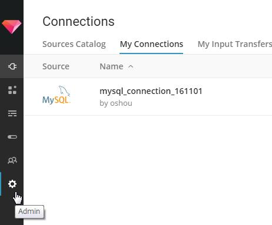
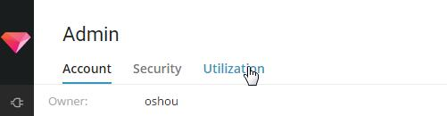
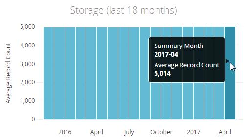
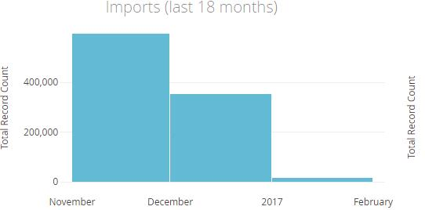

TreasureDataは「ストア出来るのは月間xxxレコード、年間xxxレコードまで」という上限があるかと思いますが、上限超えしていないか確認のため現在使用量を調べてみました。
  
<!-- more -->

TreasureDataログイン後の左メニューから「Admin」アイコンをクリック  

「Admin」画面で「Utilization」タブをクリック

取扱レコードの各種情報が表示されます。  
「Storage(last 18 months)」セクションで直近の合計レコード数が確認出来ます。  
合計レコード数はこちらで確認しましょう。

「Imports(last 18 months)では直近の月間レコードインポート数が確認出来ます。  
毎月のレコード数が上限超えしていないかはこちらで確認しましょう。

